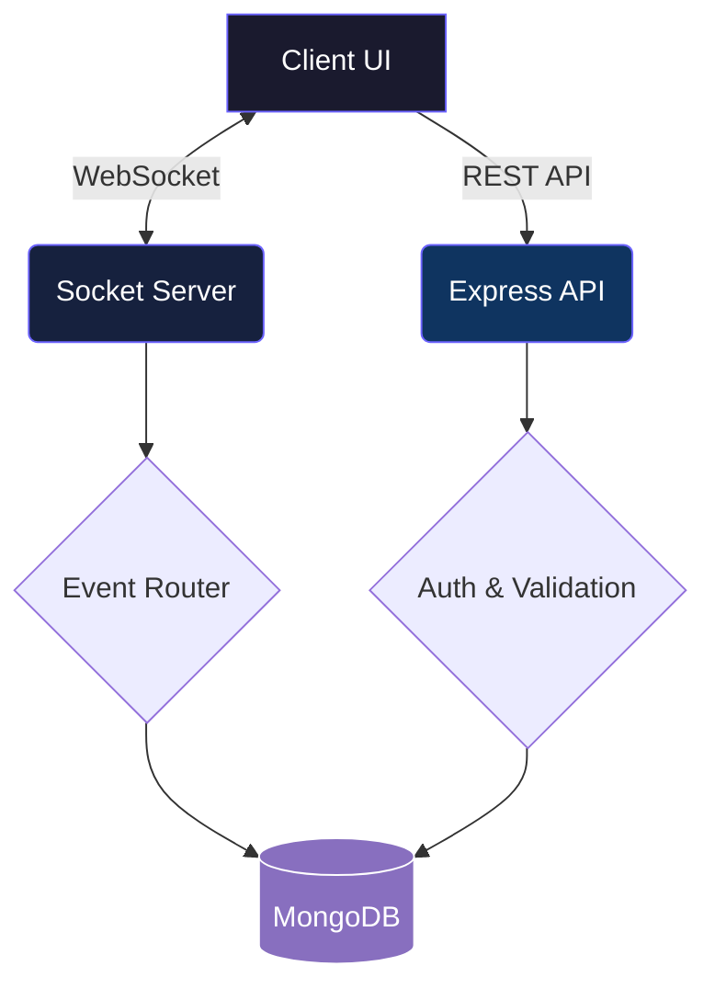

<


</div>

---

## 🎯 Motivation

Building robust, real-time communication systems requires careful architecture to handle concurrent connections efficiently. **ChatPro** is designed to provide a seamless, instantaneous messaging experience with a focus on:

- **Low-latency message delivery** via WebSockets
- **Scalable architecture** separating API routes and socket handlers
- **Containerized deployment** for environment consistency

---

## ✨ Key Features

| Feature | Description |
|---|---|
| ⚡ **Real-Time Engine** | Instant messaging powered by WebSockets |
| 👥 **Room Management** | Create, join, and manage private/public chat rooms |
| 🔐 **Authentication** | Secure JWT-based user authentication |
| 📝 **Message History** | Persistent storage of conversation history |
| 🐳 **Docker Native** | Fully containerized environment with Docker Compose |
| 📱 **Responsive UI** | Clean interface accessible across all device sizes |

---

## 🛠️ Tech Stack

| Component | Technology |
|---|---|
| **Frontend** | HTML5, CSS3, Vanilla JavaScript |
| **Backend API** | Node.js, Express.js |
| **WebSocket** | Socket.io |
| **Database** | MongoDB |
| **Containerization** | Docker, Docker Compose |

---

## 🚀 Getting Started

### Prerequisites

- [Node.js](https://nodejs.org/) v16+
- [MongoDB](https://www.mongodb.com/) (running locally or via Atlas)
- [Docker](https://www.docker.com/) (recommended)

### Running with Docker (Recommended)

```bash
# Clone the repository
git clone https://github.com/Kushagra-Dobriyal/chatpro.git
cd chatpro

# Build and start the containers
docker-compose up --build

# The application will be available at http://localhost:3000
```

### Local Development Setup

```bash
# Clone the repository
git clone https://github.com/Kushagra-Dobriyal/chatpro.git
cd chatpro

# Install dependencies
npm install

# Setup environment variables
cp .env.example .env
# Edit .env with your MongoDB URI

# Start development server
npm run dev
```

---

## 📁 Architecture Overview



---

## 🤝 Contributing

Contributions are welcome! Please feel free to submit a Pull Request.

1. Fork the repository
2. Create your feature branch (`git checkout -b feature/amazing-feature`)
3. Commit your changes (`git commit -m 'Add amazing feature'`)
4. Push to the branch (`git push origin feature/amazing-feature`)
5. Open a Pull Request

---

## 📝 License

This project is open source and available under the [MIT License](LICENSE).

---

<div align="center">

**Built with ❤️ by [Kushagra Dobriyal](https://github.com/Kushagra-Dobriyal)**

⭐ Star this repo if you found it useful!

</div>
]]>
